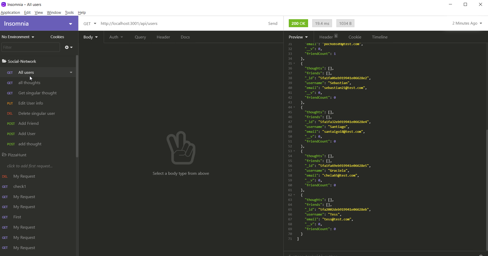

**Social Media Startup**

  ## **Description**
  * This is an API for a social network web application where users can share their thoughts, react to friends’ thoughts, and create a friend list.
   
  ## **Table of Contents**
  ### [Installation](#Installation)
  ### [Usage](#Usage) 
  ### [Contributing](#contributing)
    
  ## Installation
  * npm install
  * npm install express
  * npm i mongoose
  * npm i moment
  
  
  ## Usage
 
 
 

  ## **License:**
  This project is protected under the MIT license.

  ## Contributing
  * express
  * mongoose
  
  ## **Questions**
  * Visit me at [gitHub](http://www.github.com/pochobs)
  * For additional questions, please reach me at: [pochobs@gmail.com](mailto:pochobs@gmail.com)

This is the preview of the insomnia functionality:

[Link to video](https://drive.google.com/file/d/1TW4yEoyeoKr2Fnep-O5i5fTVyhI0NwkZ/view)

  <iframe src="https://drive.google.com/file/d/1TW4yEoyeoKr2Fnep-O5i5fTVyhI0NwkZ/preview" width="640" height="480"></iframe>
